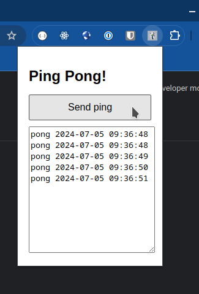
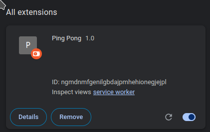

# Example Ping pong browser extension

Example Chrome extension that communicates with an application on the host using `native messaging host`.

See: [LICENSE](LICENSE)

## See
* https://developer.mozilla.org/en-US/docs/Mozilla/Add-ons/WebExtensions/Native_messaging
* https://github.com/mdn/webextensions-examples/blob/main/native-messaging/app/ping_pong.py

## Notes / hints
* In the Python script, any print out breaks the Chrome communication!
* Checkout the Makefile for how to install the Chrome native messaging files.
* Start Chrome from a terminal / command to see all the errors from the Python script.
* Extension logs and errors can be found in the "chrome://extensions" section by clicking the "service worker" link.
* Use `port.postMessage("ping");` in the service worker console to send a message.
* The full app path and extension ID needs to be in the [ping_pong.json](native_messaging_hosts%2Fping_pong.json) and this is unique per extension install.
* You can load the extension using "Load unpacked" but you need to have "Developer mode" enabled in the top right.

## Screenshots

### The extension in action

### The extension

